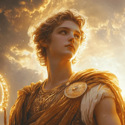

<!-- PROJECT SHIELDS -->
[![Contributors][contributors-shield]][contributors-url]
[![Forks][forks-shield]][forks-url]
[![Stargazers][stars-shield]][stars-url]
[![Issues][issues-shield]][issues-url]
[![GPL v3 License][license-shield]][license-url]
[![LinkedIn][linkedin-shield]][linkedin-url]

<div align="center">
  <a href="https://github.com/DanteZulli/apolo-music-bot">
    
  </a>

  <h3 align="center">Apolo Music Bot</h3>
  <p align="center">
    <a href="https://www.java.com/"></a>
    <a href="https://spring.io/"></a>
    <a href="https://gradle.org/"></a>
    <a href="https://podman.io/"></a>
  </p>

  <p align="center">
    A self-hosted, feature-rich music bot for Discord, built with Java using <a href="https://github.com/DV8FromTheWorld/JDA">JDA</a> and <a href="https://github.com/lavalink-devs/lavaplayer">LavaPlayer</a>.
    <br />
    <a href="docs/index.md"><strong>Explore the docs »</strong></a>
  </p>
</div>

## About

Apolo plays music in your Discord voice channels through simple slash commands. Queue up tracks, pause, skip, and manage playback without leaving the chat.

- Slash commands with queue management
- Runs locally with Gradle or containerized with Docker / Podman
- Voice encryption (DAVE) ready for current Discord requirements

## Quickstart

```bash
git clone https://github.com/DanteZulli/apolo-music-bot.git
cd apolo-music-bot
cp .envrc.sample .envrc # then set DISCORD_BOT_TOKEN
./gradlew bootRun
```

## Acknowledgments

If you like this bot or find the project interesting, don't forget to check out the libraries that made it possible and drop them a star.

* [JDA](https://github.com/DV8FromTheWorld/JDA) - The Java library for Discord API
* [LavaPlayer](https://github.com/lavalink-devs/lavaplayer) - Audio player library for Discord bots. We also use the [youtube-source](https://github.com/lavalink-devs/youtube-source) manager.
  * Special thanks to the [original LavaPlayer](https://github.com/sedmelluq/lavaplayer), which inspired us to start building this bot before migrating to the fork.

Special shoutout to the creators of [JMusicBot](https://github.com/jagrosh/MusicBot) and [FredBoat](https://github.com/freyacodes/archived-bot/), whose open-source projects served as excellent references and learning resources.

## License

This project is licensed under the GPL v3 License. See the `LICENSE` file for details.

<!-- MARKDOWN LINKS & IMAGES -->
[contributors-shield]: https://img.shields.io/github/contributors/DanteZulli/apolo-music-bot?style=for-the-badge
[contributors-url]: https://github.com/DanteZulli/apolo-music-bot/graphs/contributors
[forks-shield]: https://img.shields.io/github/forks/DanteZulli/apolo-music-bot?style=for-the-badge
[forks-url]: https://github.com/DanteZulli/apolo-music-bot/network/members
[stars-shield]: https://img.shields.io/github/stars/DanteZulli/apolo-music-bot?style=for-the-badge
[stars-url]: https://github.com/DanteZulli/apolo-music-bot/stargazers
[issues-shield]: https://img.shields.io/github/issues/DanteZulli/apolo-music-bot.svg?style=for-the-badge
[issues-url]: https://github.com/DanteZulli/apolo-music-bot/issues
[license-shield]: https://img.shields.io/github/license/DanteZulli/apolo-music-bot.svg?style=for-the-badge
[license-url]: https://github.com/DanteZulli/apolo-music-bot/blob/master/LICENSE
[linkedin-shield]: https://img.shields.io/badge/linkedin-%230077B5.svg?style=for-the-badge&logo=linkedin&logoColor=white
[linkedin-url]: https://www.linkedin.com/in/dante-zulli/
