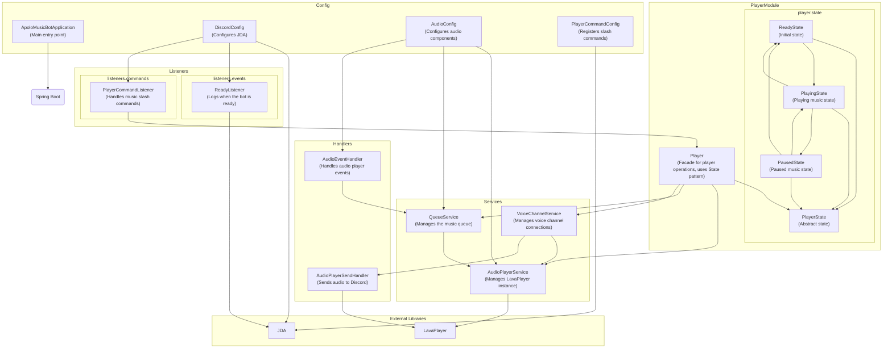

```mermaid
graph TD
    subgraph External Libraries
        JDA
        LavaPlayer
    end

    subgraph Config
        ApoloMusicBotApplication["ApoloMusicBotApplication<br>(Main entry point)"]
        DiscordConfig["DiscordConfig<br>(Configures JDA)"]
        AudioConfig["AudioConfig<br>(Configures audio components)"]
        PlayerCommandConfig["PlayerCommandConfig<br>(Registers slash commands)"]
    end

    subgraph Listeners
        subgraph "listeners.commands"
            PlayerCommandListener["PlayerCommandListener<br>(Handles music slash commands)"]
        end
        subgraph "listeners.events"
            ReadyListener["ReadyListener<br>(Logs when the bot is ready)"]
        end
    end

    subgraph Handlers
        AudioPlayerSendHandler["AudioPlayerSendHandler<br>(Sends audio to Discord)"]
        AudioEventHandler["AudioEventHandler<br>(Handles audio player events)"]
    end

    subgraph Services
        AudioPlayerService["AudioPlayerService<br>(Manages LavaPlayer instance)"]
        QueueService["QueueService<br>(Manages the music queue)"]
        VoiceChannelService["VoiceChannelService<br>(Manages voice channel connections)"]
    end

    subgraph PlayerModule
        Player["Player<br>(Facade for player operations, uses State pattern)"]
        subgraph "player.state"
            PlayerState["PlayerState<br>(Abstract state)"]
            ReadyState["ReadyState<br>(Initial state)"]
            PlayingState["PlayingState<br>(Playing music state)"]
            PausedState["PausedState<br>(Paused music state)"]
        end
    end

    %% Relationships
    ApoloMusicBotApplication --> SpringApplication
    SpringApplication(Spring Boot)

    DiscordConfig --> JDA
    DiscordConfig --> ReadyListener
    DiscordConfig --> PlayerCommandListener

    PlayerCommandConfig --> JDA

    AudioConfig --> AudioPlayerService
    AudioConfig --> QueueService
    AudioConfig --> AudioEventHandler

    PlayerCommandListener --> Player

    ReadyListener --> JDA

    AudioPlayerSendHandler --> LavaPlayer
    AudioEventHandler --> QueueService

    AudioPlayerService --> LavaPlayer
    QueueService --> AudioPlayerService
    VoiceChannelService --> AudioPlayerService
    VoiceChannelService --> AudioPlayerSendHandler

    Player --> PlayerState
    Player --> AudioPlayerService
    Player --> QueueService
    Player --> VoiceChannelService

    ReadyState --> PlayerState
    PlayingState --> PlayerState
    PausedState --> PlayerState

    ReadyState --> PlayingState
    PlayingState --> PausedState
    PlayingState --> ReadyState
    PausedState --> PlayingState
    PausedState --> ReadyState
```
